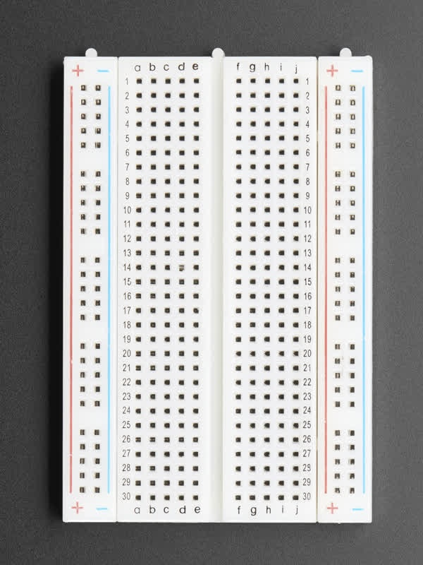

# Basic electronics

- [Basic electronics](#basic-electronics)
  - [Electricity principles](#electricity-principles)
    - [Electricity flow](#electricity-flow)
    - [What is Voltage?](#what-is-voltage)
  - [Breadboards](#breadboards)
  - [Multimeter](#multimeter)
    - [Using a Multimeter Measuring Voltage (V)](#using-a-multimeter-measuring-voltage-v)
    - [Using a Multimeter Measuring Current (A)](#using-a-multimeter-measuring-current-a)
    - [Using a Multimeter Measuring Resistance (Ω)](#using-a-multimeter-measuring-resistance-ω)
    - [Using a Multimeter Measuring Testing Continuity](#using-a-multimeter-measuring-testing-continuity)
  - [Soldering](#soldering)

## Electricity principles

### Electricity flow

The conventional direction of current, first defined by [Benjamin Franklin](https://en.wikipedia.org/wiki/Benjamin_Franklin), that became known as conventional current, is from positive to negative. The positively charged particle are free to move and the negatively charged particles are fixed, so positive moves towards negative.

Later [J. J. Thomson](https://en.wikipedia.org/wiki/J._J._Thomson) discovered the [electron](https://en.wikipedia.org/wiki/Electron) which is negatively charged, and consequently that the flow of electricity is from negative to positive.

> The conventional direction of current, also known as conventional current, is arbitrarily defined as the direction in which positive charges flow. In a conductive material, the moving charged particles that constitute the electric current are called charge carriers. In metals, which make up the wires and other conductors in most electrical circuits, the positively charged atomic nuclei of the atoms are held in a fixed position, and the negatively charged electrons are the charge carriers, free to move about in the metal. In other materials, notably the semiconductors, the charge carriers can be positive or negative, depending on the dopant used. Positive and negative charge carriers may even be present at the same time, as happens in an electrolyte in an electrochemical cell.
>
> A flow of positive charges gives the same electric current, and has the same effect in a circuit, as an equal flow of negative charges in the opposite direction. Since current can be the flow of either positive or negative charges, or both, a convention is needed for the direction of current that is independent of the type of charge carriers. Negatively charged carriers, such as the electrons (the charge carriers in metal wires and many other electronic circuit components), therefore flow in the opposite direction of conventional current flow in an electrical circuit.
>
> **Reference direction**
>
> A current in a wire or circuit element can flow in either of two directions. When defining a variable _I_ to represent the current, the direction representing positive current must be specified, usually by an arrow on the circuit schematic diagram. This is called the reference direction of the current _I_. When analyzing electrical circuits, the actual direction of current through a specific circuit element is usually unknown until the analysis is completed. Consequently, the reference directions of currents are often assigned arbitrarily. When the circuit is solved, a negative value for the current implies the actual direction of current through that circuit element is opposite that of the chosen reference direction.

[Wikipedia - Electric current](https://en.wikipedia.org/wiki/Electric_current#Conventions)

### What is Voltage?

> Voltage, also known as **(electrical) potential difference, electric pressure**, or **electric tension** is the difference in electric potential between two points. In a static electric field, it corresponds to the work needed per unit of charge to move a positive test charge from the first point to the second point. In the International System of Units (SI), the derived unit for voltage is the volt (V).

[Wikipedia - Voltage](https://en.wikipedia.org/wiki/Voltage)

Voltage can be seen as the force needed to move a charged particle (electron) inside a wire. Volts is the unit used to describe the strength of this force. When applying Voltage to a circuit it causes the electrons to move along the wires and the flow of electrons in a wire is [Electric Current](https://en.wikipedia.org/wiki/Electric_current).

## Breadboards

Breadboards are used to prototyping a circuit. In the following breadboard we have 4 set of columns:

- One set labeled **a b c d e**, within this set each row 1 to 30 is connected horizontally. So something we plug in a1 it will be connected to something connected in e1, but is is not connected to something in any of the other rows, unless we use a jumper wire to connect different rows.
- Another set labeled **f g h i f** works in the same way, as the above.
- Then we have in each extremity 2 columns labeled **+** (positive) and **-** (negative). These are connected vertically.

The following GIF from Adafruit show how are the breadboards connected.

- [Adafruit Breadboards](https://learn.adafruit.com/breadboards-for-beginners/breadboards)
- [Wikipedia Breadboard](https://en.wikipedia.org/wiki/Breadboard)

## Multimeter

The most common measures we will need are:

<!-- markdownlint-disable MD033 -->

- Voltage: V
  - AC Voltage: V~
  - DC Voltage: V⎓
  - AC/DC Voltage V≂
  - AC/DC milliVolts mV≂
- Current: Amperage A
  - AC Amperage A~
  - AC Amperage A⎓
  - AC/DC Amperage A≂
- Resistance: Ω
- Continuity: `)))))`

Components of a Multimeter:

- Display: Shows the measurement readings.
- Selection Dial: Allows you to choose the type of measurement (voltage, current, resistance, continuity).
- Probes: Red (positive) and black (negative) probes are used to make contact with the circuit.
- Ports: Different input ports for the probes, usually marked COM (common/ground), VΩ (voltage/resistance), and mA/10A (current).

Some, more simple, multimeters do not have auto-ranging feature, so first we need to determine the expected voltage before the measurement. Such multimeters usually have the following modes available (here considering V⎓, actual ranges vary from model to model):

- 200mV⎓ -> the expected Voltage is between 0 Volts and 200 milliVolts
- 2000mV⎓ -> the expected Voltage is between 200 milliVolts and 2000 milliVolts
- 20V⎓ -> the expected Voltage is between 2000 milliVolts and 20 Volts
- 200V⎓ -> the expected Voltage is between 20 Volts and 200 Volts
- 500V⎓ -> the expected Voltage is between 200 Volts and 500 Volts

In such a multimeter, if we are expecting a Voltage of 5V, we should set the multimeter to measure up to 20V. The same principle applies when measuring Current (A), although in this case, if we measure a higher value than the selected range we can burn a fuse of the multimeter. In either case always start with the highest range when uncertain.

### Using a Multimeter Measuring Voltage (V)

There are two types fo Voltage Measurement:

- DC Voltage (V with straight line Voltage: V⎓): For batteries, DC power supplies.
- AC Voltage (V with wavy line: V~): For mains electricity, like a socket at home.

Steps:

- Set the Dial: Turn the dial to the appropriate voltage type (V⎓ for DC, V~ for AC).
- Connect Probes:
  - Black probe to **COM** port.
  - Red probe to **VΩ** port.
- Measure:
  - Touch the black probe to the negative side (or ground) of the circuit.
  - Touch the red probe to the positive side of the component or circuit.
  - Read the voltage on the display.

### Using a Multimeter Measuring Current (A)

there are two types of Current Measurement:

- DC Current (A with straight line: A~). For batteries, DC power supplies.
- AC Current (A with wavy line: A⎓). For mains electricity, like a socket at home.
<!-- markdownlint-enable MD033 -->

Steps:

- Set the Dial: Turn the dial to the appropriate current type and range (often A⎓ for DC current).
- Connect Probes:
  - Black probe to **COM** port.
  - Red probe to the **mA** port for small currents or **10A** port for larger currents. Some multimeters have a single port **mA/A**
- Measure:
  - Break the circuit where we want to measure the current.
  - Insert the multimeter in series with the circuit (current flows through the multimeter).
  - Read the current on the display.

Note: Always start with the highest range to avoid damaging the multimeter, then switch to lower ranges as needed.

### Using a Multimeter Measuring Resistance (Ω)

With this setting we can measure resistance in a circuit. We could use to measure the resistance in a Resistor, for example.

Steps:

- Set the Dial: Turn the dial to the resistance measurement (Ω symbol).
- Connect Probes:
  - Black probe to **COM** port.
  - Red probe to **VΩ** port.
- Measure:
  - Ensure the circuit is powered off (no voltage).
  - Touch the probes to either side of the component whose resistance we want to measure.
  - Read the resistance on the display.

Note: If measuring a component in-circuit, ensure there's no parallel path that could affect the reading.

### Using a Multimeter Measuring Testing Continuity

Steps:

- Set the Dial: Turn the dial to the continuity test mode (diode symbol or sound wave symbol).
- Connect Probes:
  - Black probe to COM port.
  - Red probe to VΩ port.
- Measure:
  - Touch the probes to both ends of the wire, trace, or component we want to test.
  - If there is continuity (a complete path), the multimeter will beep (depending on model).

- [Arduino Multimeter Basics](https://docs.arduino.cc/learn/electronics/multimeter-basics/)
- [Wikipedia Multimeter](https://en.wikipedia.org/wiki/Multimeter)
- [Electric current](https://en.wikipedia.org/wiki/Electric_current)
- [Ammeter](https://en.wikipedia.org/wiki/Ammeter)
- [Adafruit Multimeter](https://learn.adafruit.com/multimeters)

## Soldering

- [The Arduino Guide to Soldering](https://docs.arduino.cc/learn/electronics/soldering-basics/)
  [Wikipedia Solder](https://en.wikipedia.org/wiki/Solder)
- [Sciences at Smith College - The Basic Soldering Guide](https://www.science.smith.edu/~jcardell/Courses/EGR328/Readings/Soldering%20Guide.pdf)
- [Adafruit Guide To Excellent Soldering](https://learn.adafruit.com/adafruit-guide-excellent-soldering)
