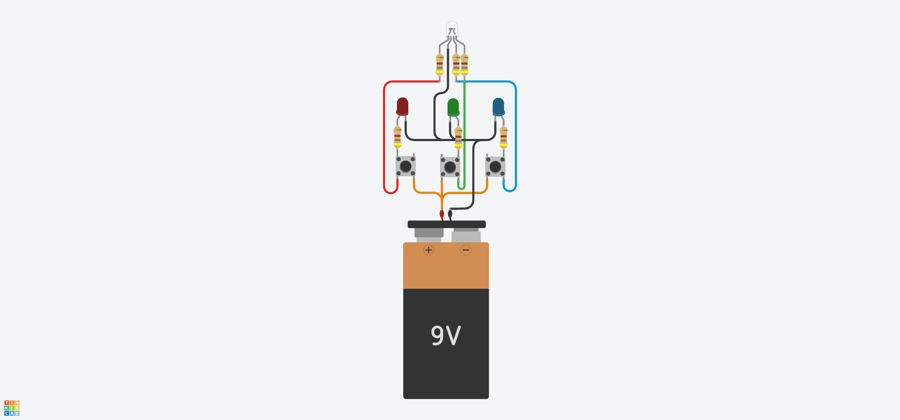
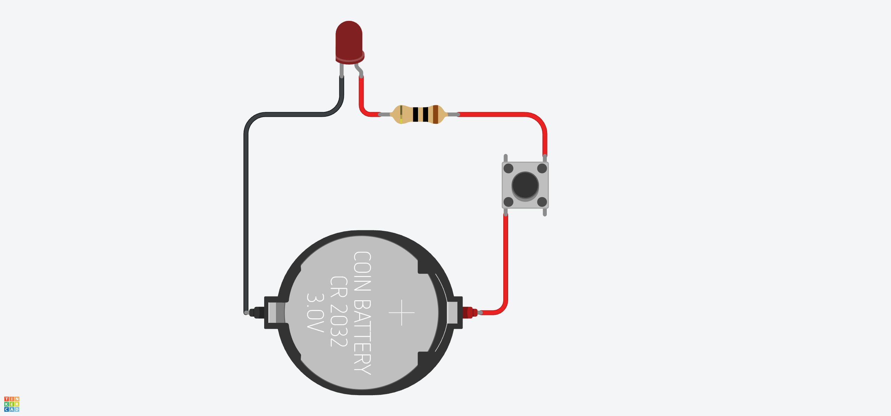
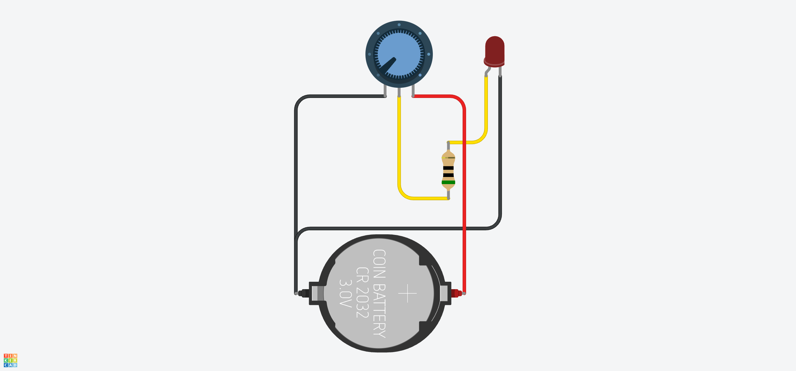
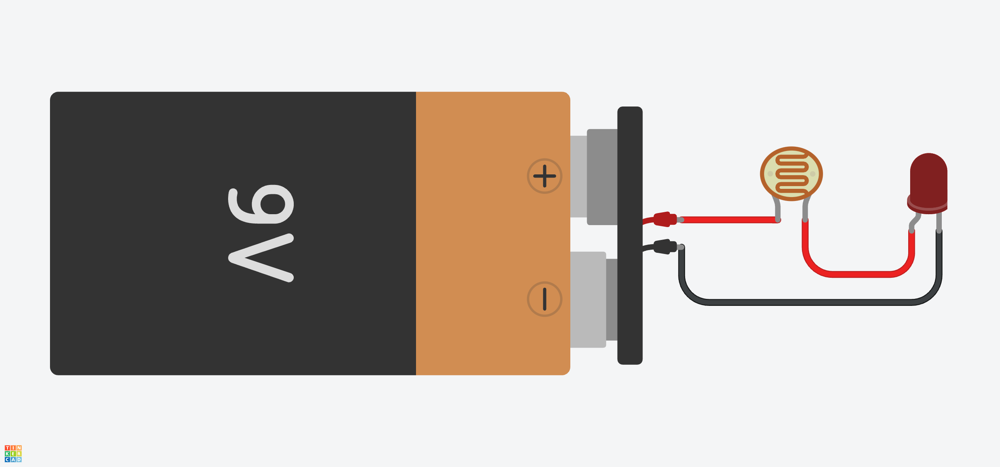

# External sensors

- [External sensors](#external-sensors)
  - [Simple sensors](#simple-sensors)
    - [Light-emitting diode (LED)](#light-emitting-diode-led)
    - [Push-button](#push-button)
    - [Potentiometer](#potentiometer)
  - [Light and color sensors](#light-and-color-sensors)
    - [Photoresistor](#photoresistor)
    - [Ultra-Violet light sensor](#ultra-violet-light-sensor)
    - [Light, RGB, and Gesture Sensor](#light-rgb-and-gesture-sensor)
  - [Temperature, humidity and pressure sensors](#temperature-humidity-and-pressure-sensors)
    - [Measuring temperature and humidity with the DHT22](#measuring-temperature-and-humidity-with-the-dht22)
    - [Thermistor](#thermistor)
    - [Measuring temperature with the TMP36](#measuring-temperature-with-the-tmp36)
    - [Measuring temperature with the MCP9808](#measuring-temperature-with-the-mcp9808)
    - [Measuring atmospheric pressure with BMP180](#measuring-atmospheric-pressure-with-bmp180)
  - [Detecting acceleration](#detecting-acceleration)
    - [Measure acceleration with ADXL335](#measure-acceleration-with-adxl335)
  - [Sensing Sound](#sensing-sound)
    - [Measuring sound with analog Grove - Sound Sensor](#measuring-sound-with-analog-grove---sound-sensor)
    - [Measuring sound with Whadda WPSE309](#measuring-sound-with-whadda-wpse309)
  - [Detecting objects with Passive Infrared sensor (PIR)](#detecting-objects-with-passive-infrared-sensor-pir)
    - [Detecting objects with HC-SR501 PIR](#detecting-objects-with-hc-sr501-pir)

## Simple sensors

### Light-emitting diode (LED)

> A light-emitting diode (LED) is a semiconductor device that emits light when current flows through it. Electrons in the semiconductor recombine with electron holes, releasing energy in the form of photons. The color of the light (corresponding to the energy of the photons) is determined by the energy required for electrons to cross the band gap of the semiconductor.

[Wikipedia Light-emitting diode](https://en.wikipedia.org/wiki/Light-emitting_diode)

Single color LEDs have an anode and a cathode, while multiple color LEDs have one terminal for each color, the most common are RGB LEDs, which have 3 terminals, for each color (red, green and blue), and a forth terminal, which either is the common anode or cathode. For standard 5mm diameter LEDs the maximum current is usually 20mA.

[Tinkercad LEDs and RGB LED](https://www.tinkercad.com/things/7xL8Mb6K1Eo-led-and-rgb-led)

### Push-button

> A push-button (also spelled pushbutton) or simply button is a simple switch mechanism to control some aspect of a machine or a process. Buttons are typically made out of hard material, usually plastic or metal.

[Wikipedia Push-button](https://en.wikipedia.org/wiki/Push-button)

In the following circuit a push-button controls an LED. If we push the button the LED turns on, release it and it tuns of. This particular button has 4 pins, the 2 pins on the left are. always connected to each other, so it's basically the same pin. The same happens to the pins on the right.

[Tinkercad Push-button LED](https://www.tinkercad.com/things/a3ouPZUmi7G-push-button-led)

### Potentiometer

> A potentiometer is a three-terminal resistor with a sliding or rotating contact that forms an adjustable voltage divider.

[Wikipedia Potentiometer](https://en.wikipedia.org/wiki/Potentiometer)

[Basics of Potentiometers with Arduino](https://docs.arduino.cc/learn/electronics/potentiometer-basics/)

In the following circuit we have a potentiometer controlling an LED. The potentiometer is has 3 pins, the middle pin is the wiper and the and the 2 outside pins one is positive and the other negative. LED and the potentiometer share the same ground, and the anode of the LED is connected to the middle pin (wiper pin) of the potentiometer. If the potentiometer is fully turned anti clockwise the LED is receiving 0V, so is off. The more we turn the potentiometer clockwise more power the LED receives.

[Tinkercad Potentiometer LED](https://www.tinkercad.com/things/1l70Uxi84LY-potentiometer-led)

## Light and color sensors

### Photoresistor

> A photoresistor (also known as a light-dependent resistor, LDR, or photo-conductive cell) is a passive component that decreases in resistance as a result of increasing luminosity (light) on its sensitive surface, in other words, it exhibits photoconductivity.

In other words the more light it receives the less resistance it has, so more current flows through it. They have two, not polarized terminals, just like a fixed resistor.

[Wikipedia Photoresistor](https://en.wikipedia.org/wiki/Photoresistor)

[Tinkercad Photoresistor LED](https://www.tinkercad.com/things/kn5F8VMbdI1-photoresistor-led)

To use a photoresistor with Arduino we need a [Voltage Divider](https://en.wikipedia.org/wiki/Voltage_divider) circuit, since the photoresistor only has two terminals and we need a third terminal, that will be the input for the Analog pin. Essentially this is the same circuit that a potentiometer uses, thats why a potentiometer has 3 terminals.

The size of the resistor to use in the voltage divider circuit, should match the resistance of the photoresistor when it in the mid range of the light we are going to measure.

### Ultra-Violet light sensor

A [Ultraviolet (UV)](https://en.wikipedia.org/wiki/Ultraviolet) light sensor is an sensor that can measure UV light. For this purpose I am using the [Grove - UV Sensor GUVA-S12D from Seed Studio](https://wiki.seeedstudio.com/Grove-UV_Sensor/). One important measure for this kind os sensor, is its [Responsivity](https://en.wikipedia.org/wiki/Responsivity) relative to the wavelength that the sensor can detect. This sensor has a response wavelength between 240 nm to 370 nm. We can use the sensor output to calculate the [UV index](https://www.epa.gov/sunsafety/uv-index-scale-0). The formula to get to the UV index from the sensor output voltage depends on the sensor characteristics, for this senor we can read in the [schematics](https://files.seeedstudio.com/wiki/Grove-UV_Sensor/res/Grove%20-%20UV%20Sensor%20v1.1sch.pdf) that `UV Index = ((Vout * R2) / ((R1 + R2) * R3 * (10^-9)) - 83) / 21`.

Usually a UV analog sensor, as only 3 terminals ground, power (5V), and an analog output pin. In the case of the sensor I am using with a Grove connections it has a fourth pin Normally Closed contact (NC) which is not used.

### Light, RGB, and Gesture Sensor

With a Sensor like [Adafruit APDS9960 Proximity, Light, RGB, and Gesture Sensor - STEMMA QT / Qwiic](https://www.adafruit.com/product/3595), we can measure basic gesture, RGB color, proximity, or ambient light.

NEED SENSOR TO TEST

## Temperature, humidity and pressure sensors

### Measuring temperature and humidity with the DHT22

The DHT22 is a digital sensor capable of measuring temperature, within -40º to 80º Celsius and humidity from (0% to 100% RH, it may take up to 5 seconds to take a measurement. With temperature and relative humidity we can calculate the [Heat index](https://en.wikipedia.org/wiki/Heat_index).

The sensor can be power with a 3.3-6V DC power supply. [Full Datasheet](https://www.sparkfun.com/datasheets/Sensors/Temperature/DHT22.pdf).

The sensor comes with either 3 or 4 pins. The ones that have 4 pins means that one of the pins is not connected, usually pin 3. We can connect it to an Arduino, using its 3 pins, one for GND anther for power, and the data pin connected to one of Arduino's digital inputs:

Notice the 10kOhm "strong" pull-up resistor. This is implemented this way to avoid a a floating condition in the Arduino digital input, when the sensor is not transmitting any data.

### Thermistor

> A thermistor is a semiconductor type of resistor whose resistance is strongly dependent on temperature, more so than in standard resistors.
>
> Depending on materials used, thermistors are classified into two types:
>
> - With NTC (Negative-temperature-coefficient) thermistors, resistance decreases as temperature rises; usually due to an increase in conduction electrons bumped up by thermal agitation from the valence band. An NTC is commonly used as a temperature sensor, or in series with a circuit as an inrush current limiter.
> - With PTC (Positive-temperature-coefficient) thermistors, resistance increases as temperature rises; usually due to increased thermal lattice agitations, particularly those of impurities and imperfections. PTC thermistors are commonly installed in series with a circuit, and used to protect against overcurrent conditions, as resettable fuses.

[Wikipedia Thermistor](https://en.wikipedia.org/wiki/Thermistor)

As with the thermistor, we will need to assemble a voltage divider circuit to use with the Arduino.

To get the temperature of the thermistor we can use the [Steinhart–Hart equation](https://en.wikipedia.org/wiki/Steinhart%E2%80%93Hart_equation). There are Arduino libraries that implement the equation, for example [panStamp/thermistor](https://github.com/panStamp/thermistor) and [suoapvs/NTC_Thermistor](https://github.com/suoapvs/NTC_Thermistor). The coefficients needed to calculate the temperature can be found in the thermistor Datasheet. The one I am using is [NTC 10KR 500mW Ø6.5mm](https://storage.googleapis.com/mauser-public-images/prod_description_document/2023/3/33f465c10d296f2fff37f6107f732a39_ntcc-10k.pdf).

### Measuring temperature with the TMP36

The TMP36 is an analog sensor, and it is available in different packages, as we can see in the [datasheet](https://www.analog.com/media/en/technical-documentation/data-sheets/TMP35_36_37.pdf), the one that I am using is the [TO-92](https://en.wikipedia.org/wiki/TO-92), which comes with 3 pins (PIN 1, +VS; PIN 2, VOUT; PIN 3, GND).

The sensor relation between output voltage (Vout) and temperature is linear, at 10 mV/°C scale factor, as we can see in [Figure 6. Output Voltage vs. Temperature of the datasheet](https://www.analog.com/media/en/technical-documentation/data-sheets/TMP35_36_37.pdf). On **Table 4. TMP35/TMP36/TMP37 Output Characteristics**, we also notice a 0.5V (500 mV) offset from the TMP36. So we can calculate the the temperature using the following formula:

$$
Temp = \frac{Vout - 500}{10}
$$

We can connect the sensor to the Arduino in 2 ways:

- Directly to the 5V Arduino power supply. This power supply may contain noise depending on what power supply we are using to power the Arduino.
- To the built-in 3.3V power supply. This supply goes through a voltage regulator, and is a cleaner signal. If our power supply to the Arduino contains noise, we can improve sensor reading and stability using the Arduino built-in 3.3V supply. Or any other external clean power supply.

This setup can be used with any other analog sensor.

When using the 3.3V Arduino power supply we also need to connect the power supply to the [AREF (Analog Reference) pin](https://support.arduino.cc/hc/en-us/articles/360018922239-About-the-AREF-pin), to notify is that the max supply we are getting now is 3.3V.

### Measuring temperature with the MCP9808

The [MCP9808](https://www.microchip.com/en-us/product/mcp9808) is an high accuracy temperature sensor (±0.5°C). It communicates through the I²C protocol, and it has a customizable I²C address. [Microchip MCP9808 Datasheet](https://ww1.microchip.com/downloads/aemDocuments/documents/OTH/ProductDocuments/DataSheets/MCP9808-0.5C-Maximum-Accuracy-Digital-Temperature-Sensor-Data-Sheet-DS20005095B.pdf). The sensor is available in different packages:

- [Adafruit MCP9808 High Accuracy I²C Temperature Sensor Breakout - STEMMA QT / Qwiic](https://www.adafruit.com/product/5027)
- [Adafruit MCP9808 High Accuracy I²C Temperature Sensor Breakout Board](https://www.adafruit.com/product/1782)
- [Seeed Studio Grove - I²C High Accuracy Temperature Sensor(MCP9808)](https://wiki.seeedstudio.com/Grove-I2C_High_Accuracy_Temperature_Sensor-MCP9808/)

### Measuring atmospheric pressure with BMP180

The BMP180 is a digital sensor from Bosch, that we can use to [measure atmospheric pressure](https://en.wikipedia.org/wiki/Pressure_measurement) and temperature, the sensor communicates through I²C. at the moment this sensor is outdated and [Bosch as released new versions](https://www.bosch-sensortec.com/products/environmental-sensors/pressure-sensors/).

[BMP180 Digital pressure sensor datasheet](https://cdn-shop.adafruit.com/datasheets/BST-BMP180-DS000-09.pdf).

- [Adafruit BMP180 Barometric Pressure/Temperature/Altitude Sensor- 5V ready](https://www.adafruit.com/product/1603)
- [Seeed Studio Grove - Barometer Sensor (BMP180)](https://wiki.seeedstudio.com/Grove-Barometer_Sensor-BMP180/)

NEED SENSOR TO TEST

## Detecting acceleration

### Measure acceleration with ADXL335

Th ADXL335 is an 3-axis accelerometer analog sensor. It measures acceleration with a minimum full-scale range of ±3 g.

## Sensing Sound

With a microphone sensor we can capture sound ([loudness](https://en.wikipedia.org/wiki/Loudness)) and send to the Arduino either a digital or analog signal depending on the microphone. with an analog microphones we are able to capture the sound waveform and pass it to the Arduino, thus enabling us to analyse the waveform and do basic [audio signal processing](https://en.wikipedia.org/wiki/Audio_signal_processing).

### Measuring sound with analog Grove - Sound Sensor

The [Grove - Sound Sensor](https://wiki.seeedstudio.com/Grove-Sound_Sensor/) is an analog sensor. The more noise it detects the higher value we will read in the Arduino analog input.

> Grove - Sound Sensor can detect the sound intensity of the environment. The main component of the module is a simple microphone, which is based on the L358 amplifier and an electret microphone. This module's output is analog and can be easily sampled and tested by a Seeeduino.

[Grove - Sound Sensor](https://wiki.seeedstudio.com/Grove-Sound_Sensor/)

### Measuring sound with Whadda WPSE309

The Whadda WPSE309 can be used both as a analog and a digital microphone.

> This high sensitivity sound detection module detects sounds between 48 and 66 dB and has an analog as well as a digital output.
> The AO or analog output creates a real-time output voltage signal of the microphone, whereas the DO or digital output depends on the sound intensity and the threshold that has been set.

[Whadda microphone sound sensor WPSE309](https://whadda.com/product/microphone-sound-sensor-module-wpse309/)

## Detecting objects with Passive Infrared sensor (PIR)

> A passive infrared sensor (PIR sensor) is an electronic sensor that measures infrared (IR) light radiating from objects in its field of view. They are most often used in PIR-based motion detectors. PIR sensors are commonly used in security alarms and automatic lighting applications.

[Wikipedia Passive infrared sensor](https://en.wikipedia.org/wiki/Passive_infrared_sensor)

Any object with a temperature above [absolute zero](https://en.wikipedia.org/wiki/Absolute_zero) emits heat energy in the form of electromagnetic radiation. This radiation can be detected by the PIR sensor.

### Detecting objects with HC-SR501 PIR

The [HC-SR501](https://www.epitran.it/ebayDrive/datasheet/44.pdf) is digital PIR sensor, that provides several adjustments.

- **Time Delay Adjust**: Sets how long the output remains high after detecting motion. Anywhere from 5 seconds to 5minutes.
- **Sensitivity Adjust**: Sets the detection range from 3 meters to 7 meters.
- **Trigger Selection Jumper**: Set for single or repeatable triggers.
  - **H** mode: repeat trigger. Sensor output is high for as long there is movement in front of sensor.
  - **L** mode: single trigger. Sensor output is high for a short period of time (determined by delay time adjustment), then it goes low, even if there is movement in front of the sensor. Output will go high again, if detects motion, after about 3 seconds.

We can use the sensor with a simple battery, to interact with an LED.

[Tinkercad PIR and LED with battery](https://www.tinkercad.com/things/fpPOaKOp94J-passive-infrared-sensor-led-battery).

Or we can use it with the Arduino, reading the sensor output in an Arduino's digital input.

[Tinkercad PIR and LED with Arduino](https://www.tinkercad.com/things/cVIg5B548y1-passive-infrared-sensor-led).
