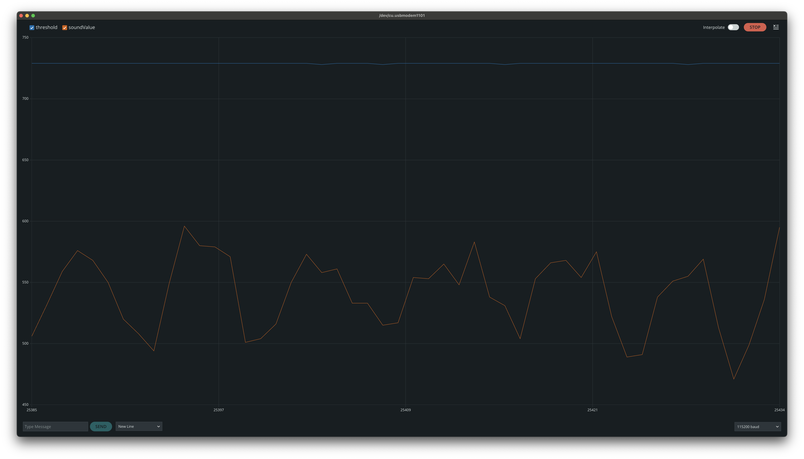

# Arduino IDE code

- [Arduino IDE code](#arduino-ide-code)
  - [Some sample sketches with external sensors](#some-sample-sketches-with-external-sensors)
    - [Controlling an LED with a push-button (pull-down resistor)](#controlling-an-led-with-a-push-button-pull-down-resistor)
    - [Using 3 potentiometer to control and RGB LED](#using-3-potentiometer-to-control-and-rgb-led)
    - [Using a photoresistor to control an LED](#using-a-photoresistor-to-control-an-led)
    - [Using a Ultraviolet light sensor](#using-a-ultraviolet-light-sensor)
    - [Using the DHT22 temperature and humidity sensor](#using-the-dht22-temperature-and-humidity-sensor)
    - [Using the Thermistor to measure temperature](#using-the-thermistor-to-measure-temperature)
    - [Using the TMP36 to measure temperature](#using-the-tmp36-to-measure-temperature)
    - [Using Grove - Sound Sensor to mesure sound intensity](#using-grove---sound-sensor-to-mesure-sound-intensity)
    - [Using Whadda WPSE309 sound sensor to mesure sound intensity](#using-whadda-wpse309-sound-sensor-to-mesure-sound-intensity)

The Arduino [language](https://docs.arduino.cc/language-reference/) is based on **C++**, and it is designed to be user friendly to beginner users. We can use the [Arduino IDE](https://docs.arduino.cc/learn/starting-guide/the-arduino-software-ide/) to create [Arduino Sketches](https://docs.arduino.cc/learn/programming/sketches/), which are just a texts files with some Arduino program that we can compile and upload to the board, using the Arduino IDE, the extension of the files is `.ino`.

There are two main [components (functions)](<https://docs.arduino.cc/learn/programming/sketches#:~:text=setup()%20and%20loop()>) that are mandatory in every Arduino sketch, `setup()` and `loop()`:

- `setup()`: It is called once, when the sketch starts. It is where we should setup pin modes and initialize libraries, or any other task that need to run once.
- `loop()`: It is called over and over while the board is running. It is where we read data from sensor and output data to sensors.

## Some sample sketches with external sensors

### Controlling an LED with a push-button (pull-down resistor)

We set Digital Pin 7 as output for the LED, and Digital Pin 5 as input from the push-button.

```c++
const int ledOutputPin = 7;
const int buttonInputPin = 5;

void setup() {
  pinMode(buttonInputPin, INPUT);
  pinMode(ledOutputPin, OUTPUT);
}

void loop() {
  digitalWrite(ledOutputPin, digitalRead(buttonInputPin));
}
```

[Tinkercad Digital Input Button Pull Down Resistor](https://www.tinkercad.com/things/doukbpoqPSL-digital-input-button-pull-down-resistor)

### Using 3 potentiometer to control and RGB LED

In the global scope we first assign constants to each pin we need. Pins A0, A1 and A2 will be the analog inputs from the potentiometers wipers, then Digital Pins 3, 5, 6, will act as PWM pins for output to the RGB LED.

In the `loop` we read what is the value of each potentiometer, with `analogRead`, then `map` the value, which is an integer from 0 to 1023, to the value supported by the PWM pins, which is between 0 and 255. Finally we output the read value to each color pin of the RGB LED with `analogWrite`.

```c++
const int redPotentiometerPin = A0;
const int greenPotentiometerPin = A1;
const int bluePotentiometerPin = A2;

const int redLedPin = 3;
const int greenLedPin = 5;
const int blueLedPin = 6;

void setup() {
  pinMode(redLedPin, OUTPUT);
  pinMode(greenLedPin, OUTPUT);
  pinMode(blueLedPin, OUTPUT);
}

void loop() {
  int redPotentiometerVal = analogRead(redPotentiometerPin);
  int greenPotentiometerVal = analogRead(greenPotentiometerPin);
  int bluePotentiometerVal = analogRead(bluePotentiometerPin);

  long redLedVal = map(redPotentiometerVal, 0, 1023, 0, 255);
  long greenLedVal = map(greenPotentiometerVal, 0, 1023, 0, 255);
  long blueLedVal = map(bluePotentiometerVal, 0, 1023, 0, 255);

  analogWrite(redLedPin, redLedVal);
  analogWrite(greenLedPin, greenLedVal);
  analogWrite(blueLedPin, blueLedVal);
}
```

[Tinkercad Potentiometers RGB LED](https://www.tinkercad.com/things/blFnvm6MEm5-potentiometers-rgb-led)

### Using a photoresistor to control an LED

We initialize two constants, an Analog Input **A0** to read the value from our **Voltage Divider** circuit and **Digital Pin 9**, to power up the LED. During setup we set **Digital Pin 9** as output. In the loop we read the value from **Voltage Divider** circuit with the photoresistor, we map this value to a digital value between 0 and 255, and also apply a [constrain](https://www.arduino.cc/reference/en/language/functions/math/constrain/) since the [map](https://www.arduino.cc/reference/en/language/functions/math/map#:~:text=Does%20not%20constrain%20values%20to%20within%20the%20range%2C%20because%20out%2Dof%2Drange%20values%20are%20sometimes%20intended%20and%20useful) function does not constrain values to within the range.

```c++
const int photoresistorInputPin = A0;
const int ledOutputPin = 9;

void setup() {
  pinMode(ledOutputPin, OUTPUT);
}

void loop() {
  int sensorValue = analogRead(photoresistorInputPin);
  sensorValue = map(sensorValue, 0, 1023, 0, 255);
  sensorValue = constrain(sensorValue, 0, 255);

  analogWrite(ledOutputPin, sensorValue);
}
```

### Using a Ultraviolet light sensor

Using a Ultraviolet light sensor to calculate the [UV index](https://www.epa.gov/sunsafety/uv-index-scale-0). This code is for [Grove - UV Sensor GUVA-S12D from Seed Studio](https://wiki.seeedstudio.com/Grove-UV_Sensor/). According to the [schematics](https://files.seeedstudio.com/wiki/Grove-UV_Sensor/res/Grove%20-%20UV%20Sensor%20v1.1sch.pdf) the formula to calculate UV Index is `((Vout * R2) / ((R1 + R2) * R3 * (10^-9)) - 83) / 21`.

In `setup` we initialize the Serial monitor with a baud rate of 9600, to print the UV Index. In a `for` loop we read the analog value from pin A0 1024 times then we get the mean value and assign it to `meanVal`. For the UV Index formula we need the sensor Vout, since the Arduino works at 5V and the analog value can range between 0 and 1023, we can convert the analog value to volts, multiplying the value by approximately 0,00489 (5 / 1023). We apply the formula and get the UV Index.

```c++
// UV Index formula ((Vout * R2) / ((R1 + R2) * R3 * (10^-9)) - 83) / 21
// R1 = 3300
// R2 = 1000
// R3 = 1000000

void setup() {
  Serial.begin(9600);
}

void loop() {
  int sensorValue;
  long sum = 0;

  for (int i = 0; i < 1024; i++) {
    sensorValue = analogRead(A0);
    sum = sensorValue + sum;
    delay(2);
  }

  long meanVal = sum / 1024;
  float sensorVout = meanVal * (5.0 / 1023.0);

  Serial.print("The current UV index is:");
  Serial.println((sensorVout * 1000 / 4.3 - 83) / 21);
  delay(20);
}
```

### Using the DHT22 temperature and humidity sensor

To read data from a DHT22, we can use the Adafruit DHT library. The following code is from Adafruit DHT library [example](https://github.com/adafruit/DHT-sensor-library/blob/master/examples/DHTtester/DHTtester.ino).

```c++
#include "DHT.h"

#define DHTPIN 2  // Digital pin connected to the DHT sensor

// Uncomment whatever type you're using!
//#define DHTTYPE DHT11   // DHT 11
#define DHTTYPE DHT22  // DHT 22  (AM2302), AM2321
//#define DHTTYPE DHT21   // DHT 21 (AM2301)


// Initialize DHT sensor.
DHT dht(DHTPIN, DHTTYPE);

void setup() {
  Serial.begin(9600);
  Serial.println(F("DHTxx test!"));

  dht.begin();
}

void loop() {
  // Wait a few seconds between measurements.
  delay(5000);

  // Reading temperature or humidity takes about 250 milliseconds!
  // Sensor readings may also be up to 2 seconds 'old' (its a very slow sensor)
  float h = dht.readHumidity();
  // Read temperature as Celsius (the default)
  float t = dht.readTemperature();
  // Read temperature as Fahrenheit (isFahrenheit = true)
  float f = dht.readTemperature(true);

  // Check if any reads failed and exit early (to try again).
  if (isnan(h) || isnan(t) || isnan(f)) {
    Serial.println(F("Failed to read from DHT sensor!"));
    return;
  }

  // Compute heat index in Fahrenheit (the default)
  float hif = dht.computeHeatIndex(f, h);
  // Compute heat index in Celsius (isFahreheit = false)
  float hic = dht.computeHeatIndex(t, h, false);

  Serial.print(F("Humidity: "));
  Serial.print(h);
  Serial.print(F("%  Temperature: "));
  Serial.print(t);
  Serial.print(F("°C "));
  Serial.print(f);
  Serial.print(F("°F  Heat index: "));
  Serial.print(hic);
  Serial.print(F("°C "));
  Serial.print(hif);
  Serial.println(F("°F"));
}
```

### Using the Thermistor to measure temperature

In this code I use the [suoapvs/NTC_Thermistor](https://github.com/suoapvs/NTC_Thermistor) to get the thermistor temperature.

```c++
#include <Thermistor.h>
#include <NTC_Thermistor.h>

#define SENSOR_PIN A0
#define REFERENCE_RESISTANCE 9830
#define NOMINAL_RESISTANCE 10000
#define NOMINAL_TEMPERATURE 25
#define B_VALUE 4050

Thermistor* thermistor;

void setup() {
  Serial.begin(9600);

  thermistor = new NTC_Thermistor(
    SENSOR_PIN,
    REFERENCE_RESISTANCE,
    NOMINAL_RESISTANCE,
    NOMINAL_TEMPERATURE,
    B_VALUE);
}


void loop() {
  const double celsius = thermistor->readCelsius();
  const double kelvin = thermistor->readKelvin();
  const double fahrenheit = thermistor->readFahrenheit();

  Serial.print("Temperature: ");
  Serial.print(celsius);
  Serial.print(" C, ");
  Serial.print(kelvin);
  Serial.print(" K, ");
  Serial.print(fahrenheit);
  Serial.println(" F");

  delay(2000);
}
```

### Using the TMP36 to measure temperature

We initial set the power supply in millivolts. When using a different power supply, from the standard built-in 5V, we need to configure the reference voltage used for analog input with [analogReference()](https://docs.arduino.cc/language-reference/en/functions/analog-io/analogReference/).

In the `loop` we get a reading and convert it to millivolts, then we convert the milivolts to temperature in celsius.

```c++
const int supplyMilliVolts = 3300; // Use 5000 for 5V standard power supply, or 3300 for 3.3V Arduino built-in power supply/

void setup() {
  analogReference(EXTERNAL); // Comment out if using the standard built-in 5V standard power supply.
  Serial.begin(9600);
}

void loop() {
  int reading = analogRead(A0);
  Serial.print(reading);
  Serial.println(" analog reading");

  float milliVolts = reading * (supplyMilliVolts / 1024.0);
  Serial.print(milliVolts);
  Serial.println(" mV");

  float temperatureC = (milliVolts - 500) / 10.0;
  Serial.print(temperatureC);
  Serial.println(" ºC");

  delay(2000);
}
```

### Using Grove - Sound Sensor to mesure sound intensity

With the following sketch we can detect sound and set a threshold with a potentiometer. If the value read from the sound sensor is higher than the threshold, we turn on the LED. The threshold can be adjust, turning the potentiometer,m so it only react to high sounds, like a clap near the microphone.

We can use the Serial Plotter to better understand the readings of the sound sensor and the potentiometer and adjust our threshold.

```c++
const int potentiometerInPin = A0;
const int soundPinIn = A1;
const int ledPinOut = 8;

int threshold = 0;
int soundValue = 0;

void setup() {
  pinMode(ledPinOut, OUTPUT);
  Serial.begin(115200);
}

void loop() {
  threshold = analogRead(potentiometerInPin);
  soundValue = analogRead(soundPinIn);

  Serial.print("threshold:");
  Serial.print(threshold);
  Serial.print(",");
  Serial.print("soundValue:");
  Serial.println(soundValue);

  if (soundValue > threshold) {
    digitalWrite(ledPinOut, HIGH);
  } else {
    digitalWrite(ledPinOut, LOW);
  }
}
```

We will see both variable in the Serial Plotter producing a graph as the sample image below.



### Using Whadda WPSE309 sound sensor to mesure sound intensity

```c++
const int soundDigitalInPin = 7;
const int letOutPin = 8;
const int soundAnalogIn = A0;

void setup() {
  pinMode(soundDigitalInPin, INPUT);
  pinMode(letOutPin, OUTPUT);
  Serial.begin(115200);
}

void loop() {
  int soundDigitalInVal = digitalRead(soundDigitalInPin);
  int soundAnalogVal = analogRead(soundAnalogIn);
  digitalWrite(letOutPin, soundDigitalInVal);

  Serial.print("soundDigitalInVal:");
  Serial.print(soundDigitalInVal);
  Serial.print(",");
  Serial.print("soundAnalogVal:");
  Serial.println(soundAnalogVal);
}
```
