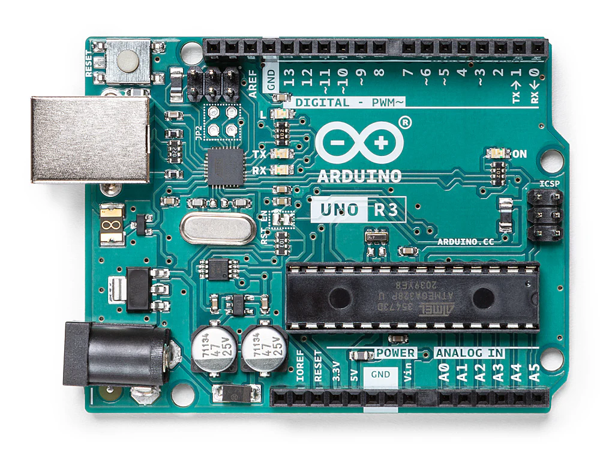

# Arduino

- [Arduino](#arduino)
  - [Arduino Uno R3 Board](#arduino-uno-r3-board)
    - [Microcontroller vs. Microprocessor](#microcontroller-vs-microprocessor)
      - [Microcontroller](#microcontroller)
      - [Microprocessor](#microprocessor)
    - [General Purpose Digital and Analog Input/Output Pins](#general-purpose-digital-and-analog-inputoutput-pins)
      - [Digital Pins](#digital-pins)
      - [Digital Output Pin](#digital-output-pin)
      - [Digital Input Pin](#digital-input-pin)
      - [Analog Output (PWM) Pins](#analog-output-pwm-pins)
      - [Analog Input Pins](#analog-input-pins)
    - [Communication](#communication)
  - [Arduino IDE code](#arduino-ide-code)
    - [Some sample Sketches](#some-sample-sketches)
      - [Controlling an LED with a push-button (pull-down resistor)](#controlling-an-led-with-a-push-button-pull-down-resistor)
      - [Using 3 potentiometer to control and RGB LED](#using-3-potentiometer-to-control-and-rgb-led)

Arduino is an open-source electronics platform based on easy-to-use hardware and software. It's intended for anyone making interactive projects. We can find several Arduino board manufactures, besides Arduino itself.

[What is Arduino?](https://docs.arduino.cc/learn/starting-guide/whats-arduino/)

## Arduino Uno R3 Board

The [Arduino Uno R3](https://docs.arduino.cc/hardware/uno-rev3/) is the simplest Arduino and the one recommended to start. The main Components of Arduino Uno R3 are:



1. **ATmega328P Microcontroller:** This is the brain of the Arduino Uno. It's an 8-bit microcontroller with 32KB of flash memory for storing code, 2KB of SRAM for variables, and 1KB of EEPROM for long-term data storage.
   - **Function:** Executes the code uploaded to the board and manages the input/output operations.
2. **Digital Input/Output Pins (14):** There are 14 digital I/O pins, numbered from 0 to 13.
   - **Function:** These pins can be configured as either inputs or outputs. They can be used to read digital signals (high or low) or control devices like LEDs, relays, and more.
3. **Analog Input Pins (6):** There are 6 analog input pins, labeled A0 to A5.
   - **Function:** These pins can read analog signals (voltage levels) and convert them to a digital value using the built-in ADC (Analog-to-Digital Converter).
4. **Power Pins:** These pins are used to supply power to the Arduino board and connected components.
   - **Types:**
     - **VIN:** Input voltage to the Arduino board when using an external power source (6-20V).
     - **5V:** Regulated 5V output used to power the board and connected components.
     - **3.3V:** Regulated 3.3V output for low-voltage components.
     - **GND:** Ground pins.
5. **Reset Button:** A small push button on the board.
   - **Function:** Resets the microcontroller, restarting the executed program from the beginning.
6. **USB Connector:** A standard USB Type-B connector.
   - **Function:** Used to connect the Arduino to a computer for uploading code and serial communication.
7. **Power Jack:** A barrel jack connector for external power supply.
   - **Function:** Allows you to power the Arduino with an external power source (7 - 12V DC recommended) (6-20V DC limit).
8. **Crystal Oscillator:** A 16 MHz quartz crystal.
   - **Function:** Provides the clock signal to the microcontroller, ensuring accurate timing and operation.
9. **Voltage Regulator:** A component that regulates the input voltage to a stable 5V.
   - **Function:** Ensures the microcontroller and other components receive a stable voltage, protecting them from fluctuations.
10. **ICSP Header:** In-Circuit Serial Programming header.
    - **Function:** Used for programming the microcontroller directly without the bootloader, useful for firmware upgrades or advanced programming.
11. **TX/RX LEDs:** LEDs labeled TX (Transmit) and RX (Receive).
    - **Function:** Indicate serial communication activity. TX blinks when data is being sent, and RX blinks when data is being received.
12. **Resettable Fuse:** A small fuse that protects the USB port.
    - **Function:** Automatically breaks the connection if too much current is drawn, protecting your computer’s USB port.
13. **SPI, I2C, and UART Communication Pins:** Dedicated pins for different communication protocols.
    - **Function:**
      - **SPI (Serial Peripheral Interface):** Pins 10 (SS), 11 (MOSI), 12 (MISO), 13 (SCK).
      - **I2C (Inter-Integrated Circuit):** Pins A4 (SDA) and A5 (SCL).
      - **UART (Universal Asynchronous Receiver/Transmitter):** Pins 0 (RX) and 1 (TX).

### Microcontroller vs. Microprocessor

#### Microcontroller

A microcontroller is an integrated circuit designed to perform specific tasks. It includes a processor, memory, and input/output (I/O) peripherals all on a single chip. Commonly used in embedded systems for specific control applications such as appliances, automotive systems, medical devices, and hobbyist projects like those built with Arduino. In the case of the original Arduino Uno R3 we can replace the replace the microcontroller if it gets damaged, other Arduino Uno R3 compatible boards come with an soldered microcontroller that can not be changed.

Components:

- Processor (CPU): The brain of the microcontroller, executing instructions.
- Memory:
  - RAM: Temporary storage for data currently being used.
  - Flash memory: Non-volatile memory used to store the program (code).
  - EEPROM: Non-volatile memory used to store data that must be preserved between reboots.
- I/O Peripherals: GPIO (General Purpose Input/Output) pins, timers, analog-to-digital converters (ADC), etc.

#### Microprocessor

A microprocessor is a general-purpose processing unit that requires external components (like memory and I/O peripherals) to function. It's essentially the CPU of a computer. Used in personal computers, laptops, smartphones, and servers where complex processing and high performance are required.

Components:

- Processor (CPU): Executes instructions and processes data.
- External Components Needed:
  - RAM: External random-access memory.
  - Storage: External non-volatile memory for storage (e.g., SSD, HDD).
  - I/O Controllers: Separate chips or integrated circuits for managing input and output devices.

[Getting Started with Arduino](https://docs.arduino.cc/learn/starting-guide/getting-started-arduino/)

### General Purpose Digital and Analog Input/Output Pins

#### Digital Pins

The Arduino Uno R3 has 14 digital I/O (input/output) pins, numbered from 0 to 13, located in the long header. These pins can be configured as either inputs or outputs. Being digital we can set the output of these pins to either **HIGH** or **LOW**. It is worth noting that the Analog pins can also be treated as Digital Pins.

- **HIGH**: Sets the pin to 5V (range 3.5V to 5V) (on a 5V Arduino board), which is equivalent to a logical 1.
- **LOW**: Sets the pin to 0V (range 0V to 3.0V), which is equivalent to a logical 0.

[Arduino Digital Pins](https://docs.arduino.cc/learn/microcontrollers/digital-pins/)

#### Digital Output Pin

We can use a digital pin as output to control an external sensor, like for example a LED. Suppose we have an LED connected to digital pin 7, and ground (GND). When we set D7 to **HIGH** this should turn one the LED, when we set it to **LOW** this should turn off the LED, so we have the possible outcomes:

| D7   | Voltage | LED |
| ---- | ------- | --- |
| HIGH | 5       | ON  |
| LOW  | 0       | OFF |


[Tinkercad Digital Output LED](https://www.tinkercad.com/things/1O5evffVupm-digital-output-led?sharecode=W9E_QD0UfJqQb_yc3fvHpQbFKt0R4mMAdd-U9MD6K7I)

#### Digital Input Pin

We can also use the digital pins to receive an input, **HIGH** or **LOW** from an external sensor like a button.

In the following schematics we use a push-button to receive an input in Digital Pin 5. To avoid a Floating or Hanging value (when the state of the digital input is not specified), we need to ad a Pull-up or Pull-down resistor.

More on [Floating ground](https://en.wikipedia.org/wiki/Floating_ground) and [Pull-up and Pull-down resistors](https://techexplorations.com/blog/electronics/blog-what-are-pull-up-and-pull-down-resistors/).

- **Pull-up resistor**:
  - When the **button is not pressed** current flows from **5V Pin** to **Digital Pin 5** with the resistor, so **Digital Pin 5** as a **HIGH** value.
  - When the **button is pressed**, **Digital Pin 5** as a **LOW** value, coming from **GND Pin**, current is not able to flow from **5V Pin** to **Digital Pin 5** due to higher resistance.

| Button    | D5   |
| --------- | ---- |
| Unpressed | HIGH |
| Pressed   | LOW  |


[Tinkercad Digital Input Button Pull-up resistor](https://www.tinkercad.com/things/4MaUEItR2Ej-digital-input-button-pull-up-resistor?sharecode=TK0xnTVVXEglhikOcDwrLlz27E5Ef8HxLA1ax_gbmfo)

- **Pull-down resistor**:
  - When the **button is not pressed**, **Digital Pin 5** as a clear **LOW** value from **GND Pin**.
  - When the **button is pressed** current flows through it from **5V Pin**, and **Digital Pin 5** as a **HIGH** value. because it has less resistance.

| Button    | D5   | LED |
| --------- | ---- | --- |
| Unpressed | LOW  | ON  |
| Pressed   | HIGH | OFF |


[Tinkercad Digital Input Button Pull-up Resistor](https://www.tinkercad.com/things/doukbpoqPSL-digital-input-button-pull-down-resistor)

#### Analog Output (PWM) Pins

Although the Arduino Uno does not have true analog output pins, it can simulate analog output using [Pulse Width Modulation (PWM)](https://docs.arduino.cc/learn/microcontrollers/analog-output/) on certain digital pins (not the analog pins directly). The PWM functionality is available on digital pins 3, 5, 6, 9, 10, and 11. PWM simulates an analog signal by rapidly switching the pin between HIGH and LOW states, creating an average voltage that can be varied by changing the duty cycle of the PWM signal. In Arduino PWM values range from 0 to 255.

Use cases:

- Dimming LEDs: Adjusting the brightness of LEDs.
- Motor Control: Controlling the speed of motors.
- Analog Voltage: Simulating varying voltage levels to other components that require an analog signal.

With an LED use case we could have the following:

| PWM | LED   | britenses |
| --: | ----- | --------- |
|   0 | off   | N/A       |
| 255 | off   | brighter  |
|  20 | off   | faint     |
| 200 | 0 off | bright    |

#### Analog Input Pins

The Arduino Uno R3 has 6 analog input pins, labeled A0 to A5. The analog input pins are used to read analog signals from sensors or other input devices. They can read voltages in the range of 0 to 5V. The analog-to-digital converter (ADC) converts the analog voltage into a 10-bit digital value, ranging from 0 to 1023, 0 corresponds to 0V and 1023 corresponds to 5V.

|   V | Digital |
| --: | ------- |
|   0 | 0       |
|   5 | 1023    |

[Arduino Analog Input Pins](https://docs.arduino.cc/learn/microcontrollers/analog-input/)

Use Cases:

- Sensors: Reading values from analog sensors like temperature sensors (LM35), light sensors (photocells), potentiometers, etc.
- Variable Inputs: Any variable input that changes voltage over time can be read using these pins.


[Tinkercad Analog Input Pins Potentiometer](https://www.tinkercad.com/things/5ZczHfOJHx4-analog-input-pins)

### Communication

The Arduino Uno R3 board implement 3 [communications protocols](https://en.wikipedia.org/wiki/Communication_protocol) that allow it to communicate with more sophisticated sensor like GPS, a 3-axis accelerometer, or even other Arduino boards or a computer.

- [Universal Asynchronous Receiver-Transmitter (UART)](https://docs.arduino.cc/learn/communication/uart/) - [Wikipedia](https://en.wikipedia.org/wiki/Universal_asynchronous_receiver-transmitter)
- [Inter-Integrated Circuit (I2C) Protocol](https://docs.arduino.cc/learn/communication/wire/) - [Wikipedia](https://en.wikipedia.org/wiki/I%C2%B2C)
- [Serial Peripheral Interface (SPI)](https://docs.arduino.cc/learn/communication/spi/) - [Wikipedia](https://en.wikipedia.org/wiki/Serial_Peripheral_Interface) - [Duplex (telecommunications)](<https://en.wikipedia.org/wiki/Duplex_(telecommunications)>)

## Arduino IDE code

The Arduino [language](https://docs.arduino.cc/language-reference/) is based on **C++**, and it is designed to be user friendly to beginner users. We can use the [Arduino IDE](https://docs.arduino.cc/learn/starting-guide/the-arduino-software-ide/) to create [Arduino Sketches](https://docs.arduino.cc/learn/programming/sketches/), which are just a texts files with some Arduino program that we can compile and upload to the board, using the Arduino IDE, the extension of the files is `.ino`.

There are two main [components (functions)](<https://docs.arduino.cc/learn/programming/sketches#:~:text=setup()%20and%20loop()>) that are mandatory in every Arduino sketch, `setup()` and `loop()`:

- `setup()`: It is called once, when the sketch starts. It is where we should setup pin modes and initialize libraries, or any other task that need to run once.
- `loop()`: It is called over and over while the board is running. It is where we read data from sensor and output data to sensors.

### Some sample Sketches

#### Controlling an LED with a push-button (pull-down resistor)

We set Digital Pin 7 as output for the LED, and Digital Pin 5 as input from the push-button.

```c++
const int ledOutputPin = 7;
const int buttonInputPin = 5;

void setup() {
  pinMode(buttonInputPin, INPUT);
  pinMode(ledOutputPin, OUTPUT);
}

void loop() {
  digitalWrite(ledOutputPin, digitalRead(buttonInputPin));
}
```

[Tinkercad Digital Input Button Pull Down Resistor](https://www.tinkercad.com/things/doukbpoqPSL-digital-input-button-pull-down-resistor)

#### Using 3 potentiometer to control and RGB LED

In the global scope we first assign constants to each pin we need. Pins A0, A1 and A2 will be the analog inputs from the potentiometers wipers, then Digital Pins 3, 5, 6, will act as PWM pins for output to the RGB LED.

In the `loop` we read what is the value of each potentiometer, with `analogRead`, then `map` the value, which is an integer from 0 to 1023, to the value supported by the PWM pins, which is between 0 and 255. Finally we output the read value to each color pin of the RGB LED with `analogWrite`.

```c++
const int redPotentiometerPin = A0;
const int greenPotentiometerPin = A1;
const int bluePotentiometerPin = A2;

const int redLedPin = 3;
const int greenLedPin = 5;
const int blueLedPin = 6;

void setup() {
  pinMode(redLedPin, OUTPUT);
  pinMode(greenLedPin, OUTPUT);
  pinMode(blueLedPin, OUTPUT);
}

void loop() {
  int redPotentiometerVal = analogRead(redPotentiometerPin);
  int greenPotentiometerVal = analogRead(greenPotentiometerPin);
  int bluePotentiometerVal = analogRead(bluePotentiometerPin);

  long redLedVal = map(redPotentiometerVal, 0, 1023, 0, 255);
  long greenLedVal = map(greenPotentiometerVal, 0, 1023, 0, 255);
  long blueLedVal = map(bluePotentiometerVal, 0, 1023, 0, 255);

  analogWrite(redLedPin, redLedVal);
  analogWrite(greenLedPin, greenLedVal);
  analogWrite(blueLedPin, blueLedVal);
}
```

[Tinkercad Potentiometers RGB LED](https://www.tinkercad.com/things/blFnvm6MEm5-potentiometers-rgb-led)
