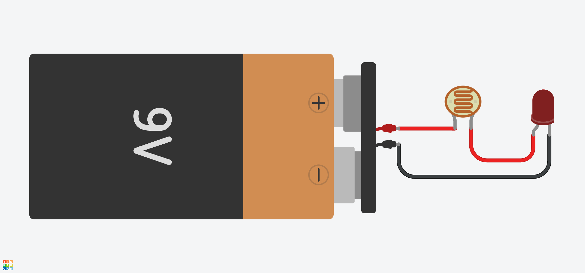

# Light and color sensors

- [Light and color sensors](#light-and-color-sensors)
  - [Photoresistor](#photoresistor)
    - [Using a photoresistor to control an LED](#using-a-photoresistor-to-control-an-led)
  - [Ultra-Violet light sensor](#ultra-violet-light-sensor)
    - [Using a Ultraviolet light sensor](#using-a-ultraviolet-light-sensor)
  - [Light, RGB, and Gesture Sensor](#light-rgb-and-gesture-sensor)

## Photoresistor

> A photoresistor (also known as a light-dependent resistor, LDR, or photo-conductive cell) is a passive component that decreases in resistance as a result of increasing luminosity (light) on its sensitive surface, in other words, it exhibits photoconductivity.

In other words the more light it receives the less resistance it has, so more current flows through it. They have two, not polarized terminals, just like a fixed resistor.

[Wikipedia Photoresistor](https://en.wikipedia.org/wiki/Photoresistor)



[Tinkercad Photoresistor LED](https://www.tinkercad.com/things/kn5F8VMbdI1-photoresistor-led)

To use a photoresistor with Arduino we need a [Voltage Divider](https://en.wikipedia.org/wiki/Voltage_divider) circuit, since the photoresistor only has two terminals and we need a third terminal, that will be the input for the Analog pin. Essentially this is the same circuit that a potentiometer uses, thats why a potentiometer has 3 terminals.


The size of the resistor to use in the voltage divider circuit, should match the resistance of the photoresistor when it in the mid range of the light we are going to measure.

### Using a photoresistor to control an LED

We initialize two constants, an Analog Input **A0** to read the value from our **Voltage Divider** circuit and **Digital Pin 9**, to power up the LED. During setup we set **Digital Pin 9** as output. In the loop we read the value from **Voltage Divider** circuit with the photoresistor, we map this value to a digital value between 0 and 255, and also apply a [constrain](https://www.arduino.cc/reference/en/language/functions/math/constrain/) since the [map](https://www.arduino.cc/reference/en/language/functions/math/map#:~:text=Does%20not%20constrain%20values%20to%20within%20the%20range%2C%20because%20out%2Dof%2Drange%20values%20are%20sometimes%20intended%20and%20useful) function does not constrain values to within the range.

```c++
const int photoresistorInputPin = A0;
const int ledOutputPin = 9;

void setup() {
  pinMode(ledOutputPin, OUTPUT);
}

void loop() {
  int sensorValue = analogRead(photoresistorInputPin);
  sensorValue = map(sensorValue, 0, 1023, 0, 255);
  sensorValue = constrain(sensorValue, 0, 255);

  analogWrite(ledOutputPin, sensorValue);
}
```

## Ultra-Violet light sensor

A [Ultraviolet (UV)](https://en.wikipedia.org/wiki/Ultraviolet) light sensor is an sensor that can measure UV light. For this purpose I am using the [Grove - UV Sensor GUVA-S12D from Seed Studio](https://wiki.seeedstudio.com/Grove-UV_Sensor/). One important measure for this kind os sensor, is its [Responsivity](https://en.wikipedia.org/wiki/Responsivity) relative to the wavelength that the sensor can detect. This sensor has a response wavelength between 240 nm to 370 nm. We can use the sensor output to calculate the [UV index](https://www.epa.gov/sunsafety/uv-index-scale-0). The formula to get to the UV index from the sensor output voltage depends on the sensor characteristics, for this senor we can read in the [schematics](https://files.seeedstudio.com/wiki/Grove-UV_Sensor/res/Grove%20-%20UV%20Sensor%20v1.1sch.pdf) that `UV Index = ((Vout * R2) / ((R1 + R2) * R3 * (10^-9)) - 83) / 21`.


Usually a UV analog sensor, as only 3 terminals ground, power (5V), and an analog output pin. In the case of the sensor I am using with a Grove connections it has a fourth pin Normally Closed contact (NC) which is not used.


### Using a Ultraviolet light sensor

Using a Ultraviolet light sensor to calculate the [UV index](https://www.epa.gov/sunsafety/uv-index-scale-0). This code is for [Grove - UV Sensor GUVA-S12D from Seed Studio](https://wiki.seeedstudio.com/Grove-UV_Sensor/). According to the [schematics](https://files.seeedstudio.com/wiki/Grove-UV_Sensor/res/Grove%20-%20UV%20Sensor%20v1.1sch.pdf) the formula to calculate UV Index is `((Vout * R2) / ((R1 + R2) * R3 * (10^-9)) - 83) / 21`.

In `setup` we initialize the Serial monitor with a baud rate of 9600, to print the UV Index. In a `for` loop we read the analog value from pin A0 1024 times then we get the mean value and assign it to `meanVal`. For the UV Index formula we need the sensor Vout, since the Arduino works at 5V and the analog value can range between 0 and 1023, we can convert the analog value to volts, multiplying the value by approximately 0,00489 (5 / 1023). We apply the formula and get the UV Index.

```c++
// UV Index formula ((Vout * R2) / ((R1 + R2) * R3 * (10^-9)) - 83) / 21
// R1 = 3300
// R2 = 1000
// R3 = 1000000

void setup() {
  Serial.begin(9600);
}

void loop() {
  int sensorValue;
  long sum = 0;

  for (int i = 0; i < 1024; i++) {
    sensorValue = analogRead(A0);
    sum = sensorValue + sum;
    delay(2);
  }

  long meanVal = sum / 1024;
  float sensorVout = meanVal * (5.0 / 1023.0);

  Serial.print("The current UV index is:");
  Serial.println((sensorVout * 1000 / 4.3 - 83) / 21);
  delay(20);
}
```

## Light, RGB, and Gesture Sensor

With a Sensor like [Adafruit APDS9960 Proximity, Light, RGB, and Gesture Sensor - STEMMA QT / Qwiic](https://www.adafruit.com/product/3595), we can measure basic gesture, RGB color, proximity, or ambient light.

NEED SENSOR TO TEST
