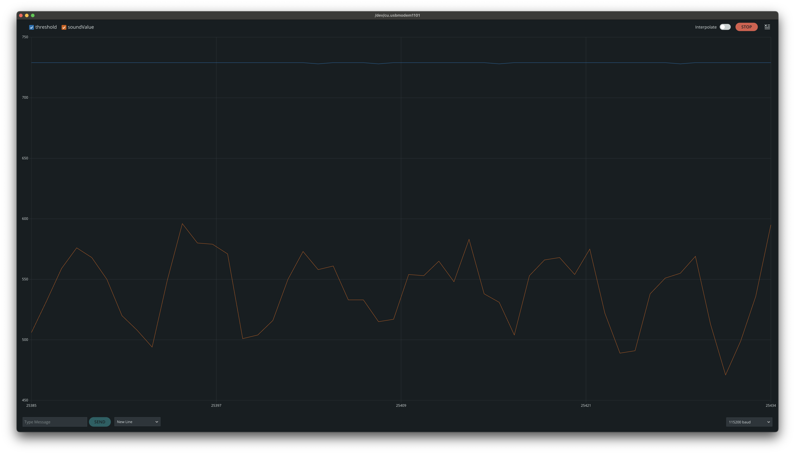

# Sensing Sound

- [Sensing Sound](#sensing-sound)
  - [Measuring sound with analog Grove - Sound Sensor](#measuring-sound-with-analog-grove---sound-sensor)
    - [Using Grove - Sound Sensor to mesure sound intensity](#using-grove---sound-sensor-to-mesure-sound-intensity)
  - [Measuring sound with Whadda WPSE309](#measuring-sound-with-whadda-wpse309)
    - [Using Whadda WPSE309 sound sensor to mesure sound intensity](#using-whadda-wpse309-sound-sensor-to-mesure-sound-intensity)

With a microphone sensor we can capture sound ([loudness](https://en.wikipedia.org/wiki/Loudness)) and send to the Arduino either a digital or analog signal depending on the microphone. with an analog microphones we are able to capture the sound waveform and pass it to the Arduino, thus enabling us to analyse the waveform and do basic [audio signal processing](https://en.wikipedia.org/wiki/Audio_signal_processing).

## Measuring sound with analog Grove - Sound Sensor

The [Grove - Sound Sensor](https://wiki.seeedstudio.com/Grove-Sound_Sensor/) is an analog sensor. The more noise it detects the higher value we will read in the Arduino analog input.

> Grove - Sound Sensor can detect the sound intensity of the environment. The main component of the module is a simple microphone, which is based on the L358 amplifier and an electret microphone. This module's output is analog and can be easily sampled and tested by a Seeeduino.

[Grove - Sound Sensor](https://wiki.seeedstudio.com/Grove-Sound_Sensor/)

### Using Grove - Sound Sensor to mesure sound intensity

With the following sketch we can detect sound and set a threshold with a potentiometer. If the value read from the sound sensor is higher than the threshold, we turn on the LED. The threshold can be adjust, turning the potentiometer,m so it only react to high sounds, like a clap near the microphone.

We can use the Serial Plotter to better understand the readings of the sound sensor and the potentiometer and adjust our threshold.

```c++
const int potentiometerInPin = A0;
const int soundPinIn = A1;
const int ledPinOut = 8;

int threshold = 0;
int soundValue = 0;

void setup() {
  pinMode(ledPinOut, OUTPUT);
  Serial.begin(115200);
}

void loop() {
  threshold = analogRead(potentiometerInPin);
  soundValue = analogRead(soundPinIn);

  Serial.print("threshold:");
  Serial.print(threshold);
  Serial.print(",");
  Serial.print("soundValue:");
  Serial.println(soundValue);

  if (soundValue > threshold) {
    digitalWrite(ledPinOut, HIGH);
  } else {
    digitalWrite(ledPinOut, LOW);
  }
}
```

We will see both variable in the Serial Plotter producing a graph as the sample image below.



## Measuring sound with Whadda WPSE309

The Whadda WPSE309 can be used both as a analog and a digital microphone.

> This high sensitivity sound detection module detects sounds between 48 and 66 dB and has an analog as well as a digital output.
> The AO or analog output creates a real-time output voltage signal of the microphone, whereas the DO or digital output depends on the sound intensity and the threshold that has been set.

[Whadda microphone sound sensor WPSE309](https://whadda.com/product/microphone-sound-sensor-module-wpse309/)


### Using Whadda WPSE309 sound sensor to mesure sound intensity

```c++
const int soundDigitalInPin = 7;
const int letOutPin = 8;
const int soundAnalogIn = A0;

void setup() {
  pinMode(soundDigitalInPin, INPUT);
  pinMode(letOutPin, OUTPUT);
  Serial.begin(115200);
}

void loop() {
  int soundDigitalInVal = digitalRead(soundDigitalInPin);
  int soundAnalogVal = analogRead(soundAnalogIn);
  digitalWrite(letOutPin, soundDigitalInVal);

  Serial.print("soundDigitalInVal:");
  Serial.print(soundDigitalInVal);
  Serial.print(",");
  Serial.print("soundAnalogVal:");
  Serial.println(soundAnalogVal);
}
```
