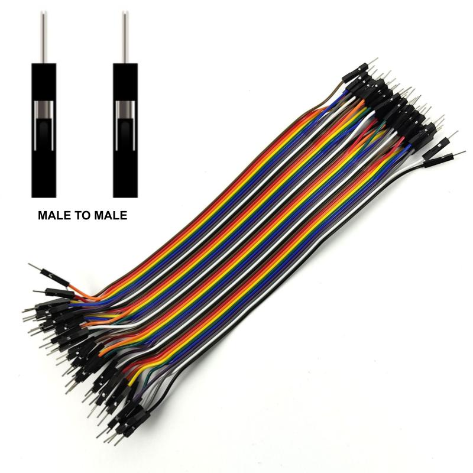
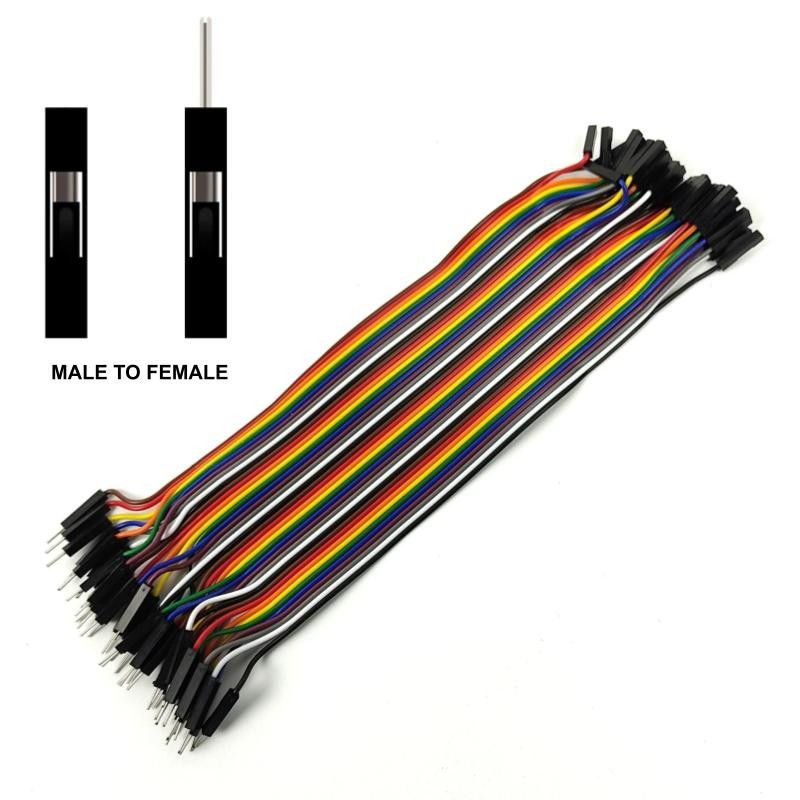
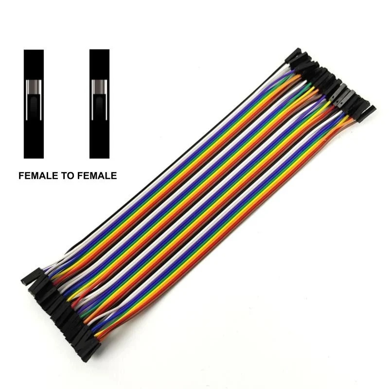
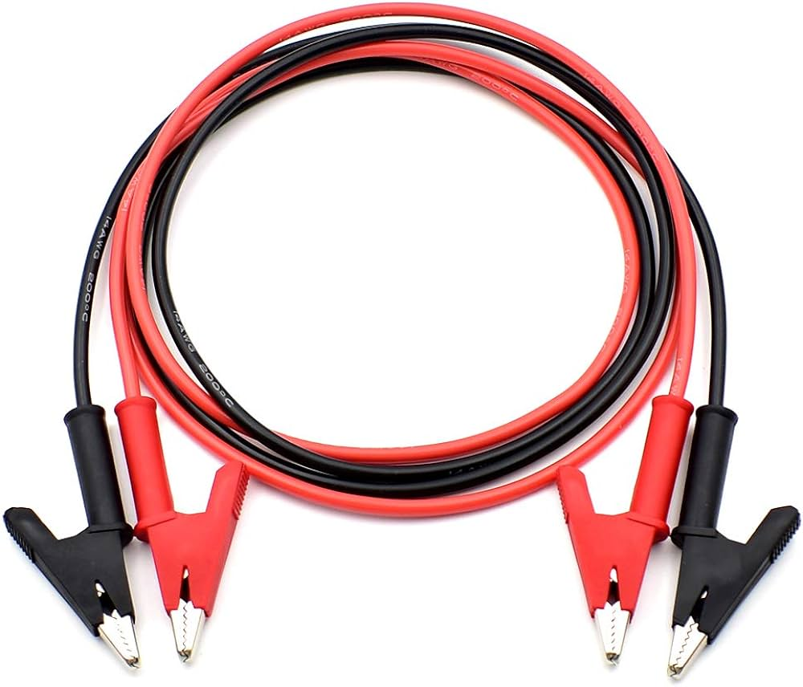

# Prototyping

- [Prototyping](#prototyping)
  - [Breadboards](#breadboards)
  - [Jumper wires](#jumper-wires)
  - [Multimeter](#multimeter)
    - [Using a Multimeter Measuring Voltage (V)](#using-a-multimeter-measuring-voltage-v)
    - [Using a Multimeter Measuring Current (A)](#using-a-multimeter-measuring-current-a)
    - [Using a Multimeter Measuring Resistance (Ω)](#using-a-multimeter-measuring-resistance-ω)
    - [Using a Multimeter Measuring Testing Continuity](#using-a-multimeter-measuring-testing-continuity)
  - [Soldering](#soldering)
  - [External sensors](#external-sensors)
    - [Simple sensors](#simple-sensors)
      - [Light-emitting diode (LED)](#light-emitting-diode-led)
      - [Push-button](#push-button)
      - [Potentiometer](#potentiometer)
    - [Light and color sensors](#light-and-color-sensors)
      - [Photoresistor](#photoresistor)
      - [Ultra-Violet light sensor](#ultra-violet-light-sensor)
      - [Light, RGB, and Gesture Sensor](#light-rgb-and-gesture-sensor)
    - [Temperature, humidity and pressure sensors](#temperature-humidity-and-pressure-sensors)
      - [Measuring temperature and humidity with the DHT22](#measuring-temperature-and-humidity-with-the-dht22)
      - [Thermistor](#thermistor)
      - [Measuring temperature with the TMP36](#measuring-temperature-with-the-tmp36)
      - [Measuring temperature with the MCP9808](#measuring-temperature-with-the-mcp9808)

## Breadboards

Breadboards are used to prototyping a circuit. In the following breadboard we have 4 set of columns:

- One set labeled **a b c d e**, within this set each row 1 to 30 is connected horizontally. So something we plug in a1 it will be connected to something connected in e1, but is is not connected to something in any of the other rows, unless we use a jumper wire to connect different rows.
- Another set labeled **f g h i f** works in the same way, as the above.
- Then we have in each extremity 2 columns labeled **+** (positive) and **-** (negative). These are connected vertically.

The following GIF from Adafruit show how are the breadboards connected.

- [Adafruit Breadboards](https://learn.adafruit.com/breadboards-for-beginners/breadboards)
- [Wikipedia Breadboard](https://en.wikipedia.org/wiki/Breadboard)

## Jumper wires

We have several types of jumper wires, I list some of the most commons below, although there are several others.

Jumper wires male to male

Jumper wires male to female

Jumper wires female to female

Jumper wires crocodile clip

## Multimeter

The most common measures we will need are:

<!-- markdownlint-disable MD033 -->

- Voltage: V
  - AC Voltage: V~
  - DC Voltage: V⎓
  - AC/DC Voltage V≂
  - AC/DC milliVolts mV≂
- Current: Amperage A
  - AC Amperage A~
  - AC Amperage A⎓
  - AC/DC Amperage A≂
- Resistance: Ω
- Continuity: `)))))`

Components of a Multimeter:

- Display: Shows the measurement readings.
- Selection Dial: Allows you to choose the type of measurement (voltage, current, resistance, continuity).
- Probes: Red (positive) and black (negative) probes are used to make contact with the circuit.
- Ports: Different input ports for the probes, usually marked COM (common/ground), VΩ (voltage/resistance), and mA/10A (current).

Some, more simple, multimeters do not have auto-ranging feature, so first we need to determine the expected voltage before the measurement. Such multimeters usually have the following modes available (here considering V⎓, actual ranges vary from model to model):

- 200mV⎓ -> the expected Voltage is between 0 Volts and 200 milliVolts
- 2000mV⎓ -> the expected Voltage is between 200 milliVolts and 2000 milliVolts
- 20V⎓ -> the expected Voltage is between 2000 milliVolts and 20 Volts
- 200V⎓ -> the expected Voltage is between 20 Volts and 200 Volts
- 500V⎓ -> the expected Voltage is between 200 Volts and 500 Volts

In such a multimeter, if we are expecting a Voltage of 5V, we should set the multimeter to measure up to 20V. The same principle applies when measuring Current (A), although in this case, if we measure a higher value than the selected range we can burn a fuse of the multimeter. In either case always start with the highest range when uncertain.

### Using a Multimeter Measuring Voltage (V)

There are two types fo Voltage Measurement:

- DC Voltage (V with straight line Voltage: V⎓): For batteries, DC power supplies.
- AC Voltage (V with wavy line: V~): For mains electricity, like a socket at home.

Steps:

- Set the Dial: Turn the dial to the appropriate voltage type (V⎓ for DC, V~ for AC).
- Connect Probes:
  - Black probe to **COM** port.
  - Red probe to **VΩ** port.
- Measure:
  - Touch the black probe to the negative side (or ground) of the circuit.
  - Touch the red probe to the positive side of the component or circuit.
  - Read the voltage on the display.

### Using a Multimeter Measuring Current (A)

there are two types of Current Measurement:

- DC Current (A with straight line: A~). For batteries, DC power supplies.
- AC Current (A with wavy line: A⎓). For mains electricity, like a socket at home.
<!-- markdownlint-enable MD033 -->

Steps:

- Set the Dial: Turn the dial to the appropriate current type and range (often A⎓ for DC current).
- Connect Probes:
  - Black probe to **COM** port.
  - Red probe to the **mA** port for small currents or **10A** port for larger currents. Some multimeters have a single port **mA/A**
- Measure:
  - Break the circuit where we want to measure the current.
  - Insert the multimeter in series with the circuit (current flows through the multimeter).
  - Read the current on the display.

Note: Always start with the highest range to avoid damaging the multimeter, then switch to lower ranges as needed.

### Using a Multimeter Measuring Resistance (Ω)

With this setting we can measure resistance in a circuit. We could use to measure the resistance in a Resistor, for example.

Steps:

- Set the Dial: Turn the dial to the resistance measurement (Ω symbol).
- Connect Probes:
  - Black probe to **COM** port.
  - Red probe to **VΩ** port.
- Measure:
  - Ensure the circuit is powered off (no voltage).
  - Touch the probes to either side of the component whose resistance we want to measure.
  - Read the resistance on the display.

Note: If measuring a component in-circuit, ensure there's no parallel path that could affect the reading.

### Using a Multimeter Measuring Testing Continuity

Steps:

- Set the Dial: Turn the dial to the continuity test mode (diode symbol or sound wave symbol).
- Connect Probes:
  - Black probe to COM port.
  - Red probe to VΩ port.
- Measure:
  - Touch the probes to both ends of the wire, trace, or component we want to test.
  - If there is continuity (a complete path), the multimeter will beep (depending on model).

- [Arduino Multimeter Basics](https://docs.arduino.cc/learn/electronics/multimeter-basics/)
- [Wikipedia Multimeter](https://en.wikipedia.org/wiki/Multimeter)
- [Electric current](https://en.wikipedia.org/wiki/Electric_current)
- [Ammeter](https://en.wikipedia.org/wiki/Ammeter)
- [Adafruit Multimeter](https://learn.adafruit.com/multimeters)

## Soldering

- [The Arduino Guide to Soldering](https://docs.arduino.cc/learn/electronics/soldering-basics/)
  [Wikipedia Solder](https://en.wikipedia.org/wiki/Solder)
- [Sciences at Smith College - The Basic Soldering Guide](https://www.science.smith.edu/~jcardell/Courses/EGR328/Readings/Soldering%20Guide.pdf)
- [Adafruit Guide To Excellent Soldering](https://learn.adafruit.com/adafruit-guide-excellent-soldering)

## External sensors

### Simple sensors

#### Light-emitting diode (LED)

> A light-emitting diode (LED) is a semiconductor device that emits light when current flows through it. Electrons in the semiconductor recombine with electron holes, releasing energy in the form of photons. The color of the light (corresponding to the energy of the photons) is determined by the energy required for electrons to cross the band gap of the semiconductor.

[Wikipedia Light-emitting diode](https://en.wikipedia.org/wiki/Light-emitting_diode)

Single color LEDs have an anode and a cathode, while multiple color LEDs have one terminal for each color, the most common are RGB LEDs, which have 3 terminals, for each color (red, green and blue), and a forth terminal, which either is the common anode or cathode. For standard 5mm diameter LEDs the maximum current is usually 20mA.

[Tinkercad LEDs and RGB LED](https://www.tinkercad.com/things/7xL8Mb6K1Eo-led-and-rgb-led)

#### Push-button

> A push-button (also spelled pushbutton) or simply button is a simple switch mechanism to control some aspect of a machine or a process. Buttons are typically made out of hard material, usually plastic or metal.

[Wikipedia Push-button](https://en.wikipedia.org/wiki/Push-button)

In the following circuit a push-button controls an LED. If we push the button the LED turns on, release it and it tuns of. This particular button has 4 pins, the 2 pins on the left are. always connected to each other, so it's basically the same pin. The same happens to the pins on the right.

[Tinkercad Push-button LED](https://www.tinkercad.com/things/a3ouPZUmi7G-push-button-led)

#### Potentiometer

> A potentiometer is a three-terminal resistor with a sliding or rotating contact that forms an adjustable voltage divider.

[Wikipedia Potentiometer](https://en.wikipedia.org/wiki/Potentiometer)

[Basics of Potentiometers with Arduino](https://docs.arduino.cc/learn/electronics/potentiometer-basics/)

In the following circuit we have a potentiometer controlling an LED. The potentiometer is has 3 pins, the middle pin is the wiper and the and the 2 outside pins one is positive and the other negative. LED and the potentiometer share the same ground, and the anode of the LED is connected to the middle pin (wiper pin) of the potentiometer. If the potentiometer is fully turned anti clockwise the LED is receiving 0V, so is off. The more we turn the potentiometer clockwise more power the LED receives.

[Tinkercad Potentiometer LED](https://www.tinkercad.com/things/1l70Uxi84LY-potentiometer-led)

### Light and color sensors

#### Photoresistor

> A photoresistor (also known as a light-dependent resistor, LDR, or photo-conductive cell) is a passive component that decreases in resistance as a result of increasing luminosity (light) on its sensitive surface, in other words, it exhibits photoconductivity.

In other words the more light it receives the less resistance it has, so more current flows through it. They have two, not polarized terminals, just like a fixed resistor.

[Wikipedia Photoresistor](https://en.wikipedia.org/wiki/Photoresistor)

[Tinkercad Photoresistor LED](https://www.tinkercad.com/things/kn5F8VMbdI1-photoresistor-led)

To use a photoresistor with Arduino we need a [Voltage Divider](https://en.wikipedia.org/wiki/Voltage_divider) circuit, since the photoresistor only has two terminals and we need a third terminal, that will be the input for the Analog pin. Essentially this is the same circuit that a potentiometer uses, thats why a potentiometer has 3 terminals.

The size of the resistor to use in the voltage divider circuit, should match the resistance of the photoresistor when it in the mid range of the light we are going to measure.

#### Ultra-Violet light sensor

A [Ultraviolet (UV)](https://en.wikipedia.org/wiki/Ultraviolet) light sensor is an sensor that can measure UV light. For this purpose I am using the [Grove - UV Sensor GUVA-S12D from Seed Studio](https://wiki.seeedstudio.com/Grove-UV_Sensor/). One important measure for this kind os sensor, is its [Responsivity](https://en.wikipedia.org/wiki/Responsivity) relative to the wavelength that the sensor can detect. This sensor has a response wavelength between 240 nm to 370 nm. We can use the sensor output to calculate the [UV index](https://www.epa.gov/sunsafety/uv-index-scale-0). The formula to get to the UV index from the sensor output voltage depends on the sensor characteristics, for this senor we can read in the [schematics](https://files.seeedstudio.com/wiki/Grove-UV_Sensor/res/Grove%20-%20UV%20Sensor%20v1.1sch.pdf) that `UV Index = ((Vout * R2) / ((R1 + R2) * R3 * (10^-9)) - 83) / 21`.

Usually a UV analog sensor, as only 3 terminals ground, power (5V), and an analog output pin. In the case of the sensor I am using with a Grove connections it has a fourth pin Normally Closed contact (NC) which is not used.

#### Light, RGB, and Gesture Sensor

With a Sensor like [Adafruit APDS9960 Proximity, Light, RGB, and Gesture Sensor - STEMMA QT / Qwiic](https://www.adafruit.com/product/3595), we can measure basic gesture, RGB color, proximity, or ambient light.

NEED SENSOR TO TEST

### Temperature, humidity and pressure sensors

#### Measuring temperature and humidity with the DHT22

The DHT22 is a digital sensor capable of measuring temperature, within -40º to 80º Celsius and humidity from (0% to 100% RH, it may take up to 5 seconds to take a measurement. With temperature and relative humidity we can calculate the [Heat index](https://en.wikipedia.org/wiki/Heat_index).

The sensor can be power with a 3.3-6V DC power supply. [Full Datasheet](https://www.sparkfun.com/datasheets/Sensors/Temperature/DHT22.pdf).

The sensor comes with either 3 or 4 pins. The ones that have 4 pins means that one of the pins is not connected, usually pin 3. We can connect it to an Arduino, using its 3 pins, one for GND anther for power, and the data pin connected to one of Arduino's digital inputs:

Notice the 10kOhm "strong" pull-up resistor. This is implemented this way to avoid a a floating condition in the Arduino digital input, when the sensor is not transmitting any data.

#### Thermistor

> A thermistor is a semiconductor type of resistor whose resistance is strongly dependent on temperature, more so than in standard resistors.
>
> Depending on materials used, thermistors are classified into two types:
>
> - With NTC (Negative-temperature-coefficient) thermistors, resistance decreases as temperature rises; usually due to an increase in conduction electrons bumped up by thermal agitation from the valence band. An NTC is commonly used as a temperature sensor, or in series with a circuit as an inrush current limiter.
> - With PTC (Positive-temperature-coefficient) thermistors, resistance increases as temperature rises; usually due to increased thermal lattice agitations, particularly those of impurities and imperfections. PTC thermistors are commonly installed in series with a circuit, and used to protect against overcurrent conditions, as resettable fuses.

[Wikipedia Thermistor](https://en.wikipedia.org/wiki/Thermistor)

As with the thermistor, we will need to assemble a voltage divider circuit to use with the Arduino.

To get the temperature of the thermistor we can use the [Steinhart–Hart equation](https://en.wikipedia.org/wiki/Steinhart%E2%80%93Hart_equation). There are Arduino libraries that implement the equation, for example [panStamp/thermistor](https://github.com/panStamp/thermistor) and [suoapvs/NTC_Thermistor](https://github.com/suoapvs/NTC_Thermistor). The coefficients needed to calculate the temperature can be found in the thermistor Datasheet. The one I am using is [NTC 10KR 500mW Ø6.5mm](https://storage.googleapis.com/mauser-public-images/prod_description_document/2023/3/33f465c10d296f2fff37f6107f732a39_ntcc-10k.pdf).

#### Measuring temperature with the TMP36

The TMP36 is an analog sensor, and it is available in different packages, as we can see in the [datasheet](https://www.analog.com/media/en/technical-documentation/data-sheets/TMP35_36_37.pdf), the one that I am using is the [TO-92](https://en.wikipedia.org/wiki/TO-92), which comes with 3 pins (PIN 1, +VS; PIN 2, VOUT; PIN 3, GND).

The sensor relation between output voltage (Vout) and temperature is linear, at 10 mV/°C scale factor, as we can see in [Figure 6. Output Voltage vs. Temperature of the datasheet](https://www.analog.com/media/en/technical-documentation/data-sheets/TMP35_36_37.pdf). On **Table 4. TMP35/TMP36/TMP37 Output Characteristics**, we also notice a 0.5V (500 mV) offset from the TMP36. So we can calculate the the temperature using the following formula:

$$
Temp = \frac{Vout - 500}{10}
$$

We can connect the sensor to the Arduino in 2 ways:

- Directly to the 5V Arduino power supply. This power supply may contain noise depending on what power supply we are using to power the Arduino.
- To the built-in 3.3V power supply. This supply goes through a voltage regulator, and is a cleaner signal. If our power supply to the Arduino contains noise, we can improve sensor reading and stability using the Arduino built-in 3.3V supply. Or any other external clean power supply.

This setup can be used with any other sensor.

When using the 3.3V Arduino power supply we also need to connect the power supply to the [AREF (Analog Reference) pin](https://support.arduino.cc/hc/en-us/articles/360018922239-About-the-AREF-pin), to notify is that the max supply we are getting now is 3.3V.

#### Measuring temperature with the MCP9808

The [MCP9808](https://www.microchip.com/en-us/product/mcp9808) is an high accuracy temperature sensor (±0.5°C). It communicates through the I2C protocol. [Microchip MCP9808 Datasheet](https://ww1.microchip.com/downloads/aemDocuments/documents/OTH/ProductDocuments/DataSheets/MCP9808-0.5C-Maximum-Accuracy-Digital-Temperature-Sensor-Data-Sheet-DS20005095B.pdf). The sensor is available in different packages:

- [Adafruit MCP9808 High Accuracy I2C Temperature Sensor Breakout - STEMMA QT / Qwiic](https://www.adafruit.com/product/5027)
- [MCP9808 High Accuracy I2C Temperature Sensor Breakout Board](https://www.adafruit.com/product/1782)
- [Grove - I2C High Accuracy Temperature Sensor(MCP9808)](https://wiki.seeedstudio.com/Grove-I2C_High_Accuracy_Temperature_Sensor-MCP9808/)
